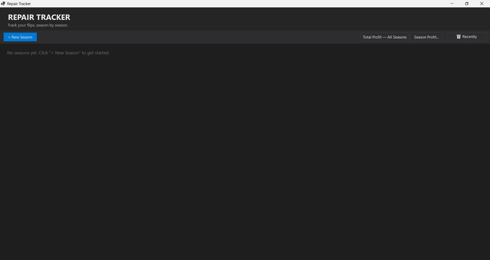
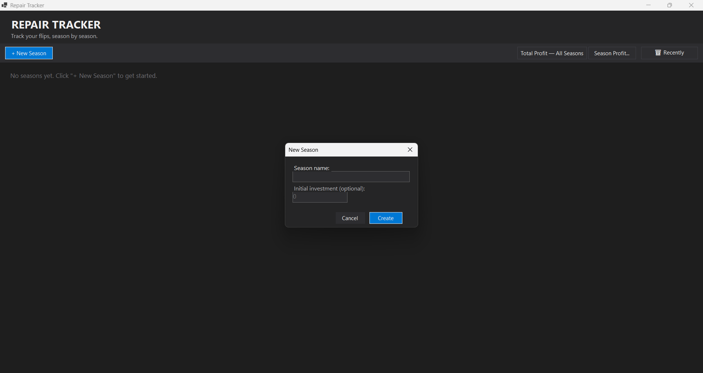
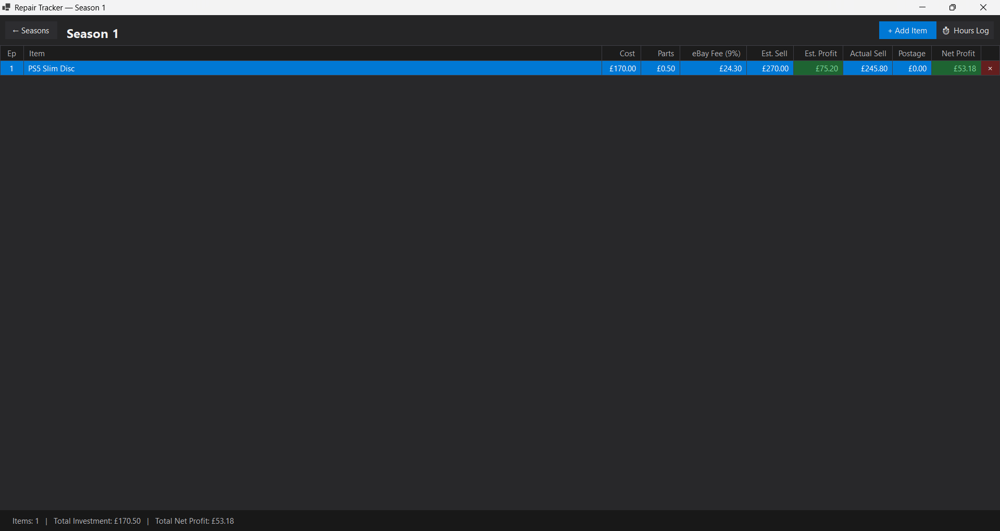
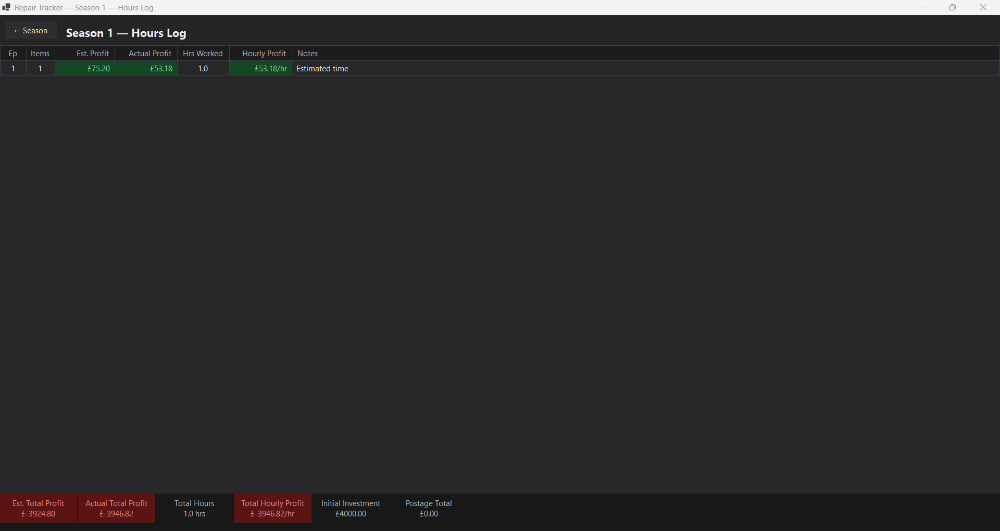
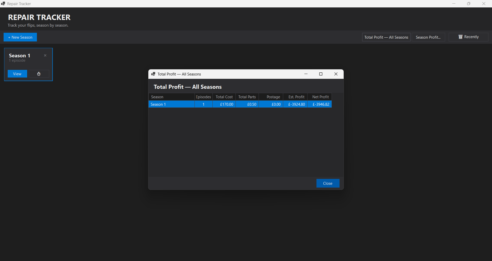

# Repair Tracker

A Windows desktop app for tracking electronics repair flips — built to replace a spreadsheet. Log every device you buy, fix, and sell on eBay, organised by season.

---

## What it does

- **Seasons** — group your flips into seasons (e.g. "Summer 2024"). Each season has an optional initial investment for pre-bought stock.
- **Episodes** — each item you repair is an episode. Log the cost, parts, estimated sell price, actual sell price, and postage. eBay fees (9%) are calculated automatically.
- **Profit tracking** — estimated profit and net profit are colour-coded green (profit) or red (loss) in real time as you fill in prices.
- **Hours log** — track how many hours you spent on each episode. Hourly profit is calculated automatically across all items in an episode.
- **Profit summary** — view total profit across all seasons or drill into a single season.
- **Soft delete** — deleted seasons go into a "Recently Deleted" bin and are permanently removed after 30 days. Restore them any time within that window.

---

## Screenshots

<!-- Add your screenshots here. Upload them to the repo and reference them like this: -->







---

## Tech stack

- **C#** — .NET 10, WinForms
- **SQLite** — via `Microsoft.Data.Sqlite`
- Local database file stored alongside the executable

---

## Running the app

1. Clone the repo
2. Open a terminal in the `RepairTracker/` folder
3. Run:
   ```
   dotnet run
   ```
   Or build and run the exe directly:
   ```
   dotnet build
   bin\Debug\net10.0-windows\RepairTracker.exe
   ```

> **Windows only** — WinForms is a Windows-specific UI framework.
